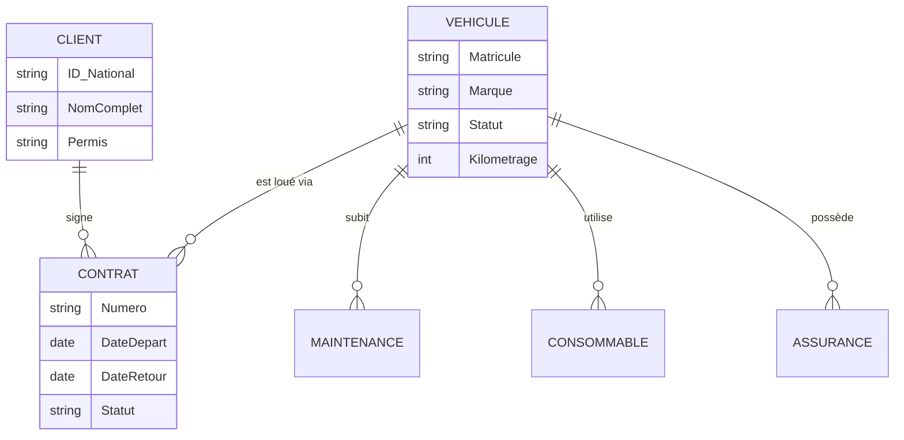
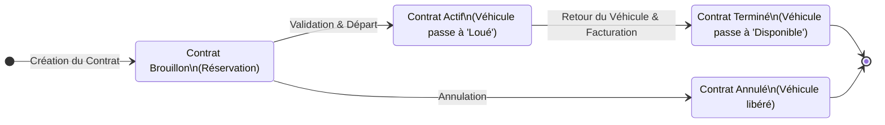
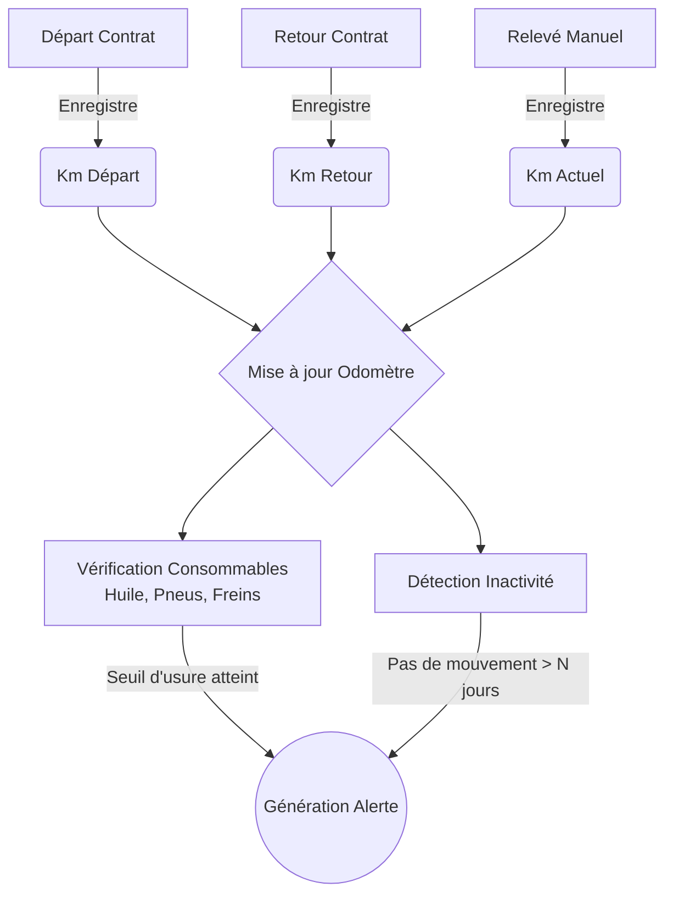

# Parc Auto — Système de Gestion de Flotte de Location

Parc Auto est une application full-stack complète et prête pour la production, conçue pour aider les entreprises de location de voitures à gérer leur flotte de véhicules. De l'enregistrement des véhicules et la gestion des clients aux contrats de location, suivi du kilométrage, maintenance, assurance et analyses opérationnelles, Parc Auto gère l'ensemble du cycle de vie des opérations de la flotte.

## ✨ Fonctionnalités Principales

- 🚗 **Gestion des Véhicules** : Opérations CRUD complètes pour la flotte de location, suivi des statuts (Disponible, Loué, En Maintenance, Réservé, Immobilisé), spécifications techniques, tarification et kilométrage initial.
- 👥 **Gestion des Clients** : Gérer les bases de données clients, y compris les pièces d'identité nationales, les permis de conduire (avec alertes d'expiration) et l'historique des locations.
- 📄 **Contrats de Location** : Le module central reliant les véhicules aux clients. Calcule les périodes de location, tarifs journaliers, cautions, frais supplémentaires, et suit l'état du contrat (Brouillon, Actif, Terminé, Annulé). Met à jour automatiquement le statut des véhicules et les relevés kilométriques.
- ⏱️ **Suivi du Kilométrage et du Carburant** : Suivi automatisé basé sur les contrats de location, plus entrées manuelles. Calcule les tendances de consommation de carburant (L/100km) et détecte les anomalies ou l'inactivité.
- 🔧 **Maintenance et Consommables** : Suivi de la maintenance préventive et corrective. Surveillez l'état d'usure des consommables (huile, filtres, freins, pneus) avec des intervalles personnalisables par kilomètres ou mois.
- 🛡️ **Assurance et Contrôles Techniques** : Suivi des polices d'assurance et dates d'inspection avec alertes d'expiration configurables en plusieurs étapes (ex: 30/15/7 jours avant expiration).
- 🔔 **Centre d'Alertes et de Notifications** : Tableau de bord centralisé pour les avertissements critiques (maintenance due, expiration d'assurance, expiration de permis).
- 📊 **Rapports et Analyses** : Suivi de la disponibilité de la flotte, coût total de possession (TCO), taux d'utilisation, et identification des meilleurs clients ou des factures impayées.
- 🌍 **Support Multilingue** : Entièrement internationalisé avec support pour le français, l'anglais et l'arabe.

## 🏗️ Architecture et Flux de Travail (Schémas)

### 1. Modèle de Données Principal (ERD)
Ce schéma illustre les relations fondamentales entre les entités clés du système.



### 2. Cycle de Vie d'un Contrat et Statut du Véhicule
Le statut d'un véhicule est automatiquement synchronisé avec l'évolution de ses contrats de location.



### 3. Flux d'Automatisation du Kilométrage et des Alertes
Chaque mouvement du véhicule met à jour l'odomètre central, ce qui déclenche les vérifications de maintenance.



## 🛠️ Stack Technologique

- **Frontend** : Angular, TypeScript, Tailwind CSS, PrimeNG (pour les composants UI complexes comme les boîtes de dialogue et tableaux).
- **Backend** : C# / API RESTful ASP.NET Core.
- **Style** : Interface moderne au thème clair avec une typographie épurée, des ombres portées douces, et des mises en page entièrement responsives.

## 🚀 Pour Commencer

### Prérequis
- Node.js & npm (pour le Frontend Angular)
- .NET SDK (pour le Backend ASP.NET Core)

### Lancer l'Application Localement

Un script pratique `start.bat` est inclus dans le répertoire racine pour lancer l'application.

Sinon, vous pouvez démarrer les services manuellement :

**1. Démarrer le Backend :**
```bash
cd Backend
dotnet run
```
L'API sera disponible sur `http://localhost:5222`.

**2. Démarrer le Frontend :**
```bash
cd Frontend
npm install
npm start
```
L'application Angular sera disponible sur `http://localhost:4200`.

## 🎨 Système de Design

L'interface a été récemment repensée pour utiliser un thème clair moderne et épuré :
- **Couleurs** : Fond blanc cassé chaud (`#FAFAF9`) avec un accent principal bleu-vert/sarcelle vibrant (`#0EA5E9`).
- **Mise en page** : Dispose d'une barre latérale persistante, extensible/rétractable pour une navigation fluide, avec l'état sauvegardé entre les sessions.
- **Composants** : Utilise des cartes basées sur les ombres (sans bordure), des champs de saisie de style "pilule" remplis, et des tableaux de données modernes pour une sensation premium.

## 🛡️ Authentification et Sécurité
Le système utilise un rôle unique d'Administrateur pour un accès complet à toutes les fonctionnalités. Toutes les mutations (Création/Mise à jour/Suppression) sont journalisées à des fins d'audit.

---
*Développé par Fateh-Dev.*
